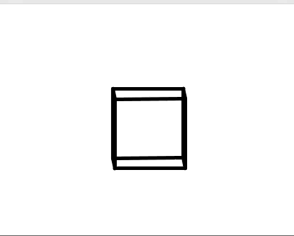
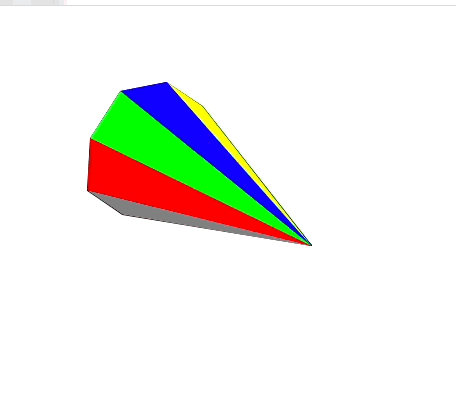

# Projection

A small tinkering project I made in 2018 (my first year of University) when I started learning Linear Algebra and Computer Science.
The code quality sucks and there are 1000 ways to do this better, but I hardly understood Java/ Good programming practices and had no idea how most things worked.

## What is this?

A small linear algebra library with two 3D implementations (Spinning Cube and Polygon).

## Requirements, Dependencies and Acknowledgements

This project is written in Java and uses the `StdDraw` library found at https://introcs.cs.princeton.edu/java/stdlib/StdDraw.java.

## To Compile.

```
cd projection/src
javac -d ../bin *.java
```

## To run

For the Spinning Cube:

```cd bin
java SpinningCube
```


For the Polygon:

```cd bin
java Polygon
```


## Bugs and Problems

The Polygon isn't running at 60 FPS.
